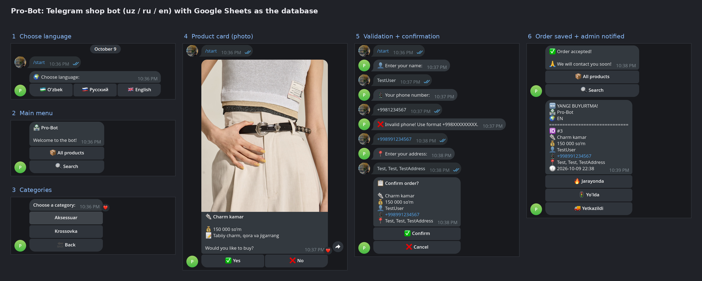

# Pro Bot

[](https://github.com/diyor-ai/pro-bot/actions/workflows/ci.yml)

A Telegram shop bot (Uzbek / Russian / English) that uses a Google Spreadsheet as its database.



Full flow: language → catalog → product → validated order → admin notification.

## Features

- Language selection per user (`uz`, `ru`, `en`)
- Product catalog by category, with product photos
- Fuzzy product search (rapidfuzz)
- Order flow: name → phone (Uzbek `+998` format, or share contact) → address → confirmation
- Orders are saved to Google Sheets; every new order is sent to the admin chat with status buttons
- Admin panel (`/admin`): new orders, statistics, status updates, broadcast to all customers; admin texts use `ADMIN_LANG`
- Language and an order in progress survive a bot restart (see [Persistence](#persistence))

## Requirements

- Python 3.11 or newer (the Docker image uses 3.11)
- A bot token from [@BotFather](https://t.me/BotFather)
- A Google Cloud service account with the Sheets and Drive APIs enabled
- A Google Spreadsheet shared (editor access) with the service account's `client_email`

## Setup

```bash
git clone git@github.com:diyor-ai/pro-bot.git
cd pro-bot
python -m venv venv
source venv/bin/activate        # Windows: venv\Scripts\activate
pip install -r requirements.txt
cp .env.example .env            # then edit .env
```

Put the service account key in `credentials.json` in the project root, or set it as a single-line JSON string in the `GOOGLE_CREDENTIALS` environment variable (takes priority). Both `.env` and `credentials.json` are git-ignored and docker-ignored; never commit them.

## Configuration (environment variables)

| Variable | Required | Default | Description |
|---|---|---|---|
| `TELEGRAM_TOKEN` | yes | – | Bot token |
| `ADMIN_CHAT_ID` | yes | – | Chat that receives new-order notifications |
| `ADMIN_IDS` | yes | – | Comma-separated Telegram user IDs allowed to use `/admin` and the status buttons |
| `SHOP_NAME` | no | `Pro Shop` | Name shown in the bot |
| `ADMIN_LANG` | no | `uz` | Language (`uz`, `ru`, `en`) of the new-order notification, admin panel and status buttons. Unknown values fall back to `uz`. The status values stored in the sheet never change (`Yangi`, `Jarayonda`, `Yo'lda`, `Yetkazildi`), only what is displayed |
| `SHEET_NAME` | no | `Mahsulotlar` | Name of the Google **Spreadsheet** (the file) |
| `CACHE_TTL` | no | `60` | Product cache lifetime in seconds |
| `FUZZY_THRESHOLD` | no | `65` | Minimum search score (0–100) |
| `GOOGLE_CREDENTIALS` | no | – | Service account JSON; otherwise `credentials.json` is used |
| `PERSISTENCE_FILE` | no | `data/bot_data.pickle` | Where per-user state is stored (see [Persistence](#persistence)) |
| `CATEGORY_EMOJI` | no | – | Extra category emoji, for example `Kiyim=👕,Poyabzal=👞` (see [Product emoji](#product-emoji)) |

### Product emoji

Products show 🛍 by default. `CATEGORY_EMOJI` in `config.py` maps a category (case-insensitive) to an emoji; the built-in map has `Krossovka` → 👟 and `Aksessuar` → 👜. Add more entries to that dict, or set the `CATEGORY_EMOJI` environment variable (`Name=emoji,Name2=emoji2`), which is merged over the built-in map.

## Spreadsheet layout

The **first worksheet** of the spreadsheet is the product list. The `Buyurtmalar` and `Users` worksheets are created automatically on the first order.

**Products (first worksheet)**

| ID | Nomi | Narxi | Kategoriya | Tavsif | Rasm_URL | Mavjud |
|---|---|---|---|---|---|---|

- `Narxi`: number; spaces or `,` as thousands separators are accepted.
- `Mavjud`: `TRUE`/`YES`/`HA` or a number greater than 0 means available; `FALSE`/`NO`/`0` hides the product; an empty cell counts as available.
- `Rasm_URL`: optional public image URL.

**Buyurtmalar (orders)**: `ID, Sana, Mahsulot, Narx, Kategoriya, Ism, Telefon, Manzil, Til, Status, User_ID`. Status is `Yangi`, `Jarayonda`, `Yo'lda` or `Yetkazildi`.

**Users**: `User_ID, Ism, Telefon, Til, Birinchi_sana, Oxirgi_sana, Buyurtmalar_soni`. Broadcast sends to every `User_ID` in this sheet, so only customers who have ordered at least once receive it.

## Running

```bash
python bot.py
```

Docker:

```bash
docker build -t pro-bot .
docker run -d --env-file .env \
  -v "$PWD/credentials.json:/app/credentials.json:ro" \
  -v pro-bot-data:/app/data \
  pro-bot
```

(`credentials.json` is not baked into the image; mount it or use `GOOGLE_CREDENTIALS`.) `Procfile` defines a `worker` process for Heroku-style platforms.

## Persistence

Per-user state (chosen language, order in progress, search mode) is kept with python-telegram-bot's `PicklePersistence` in `data/bot_data.pickle` (override with `PERSISTENCE_FILE`). It is flushed every 10 seconds and on shutdown, so after a restart users keep their language and can continue an order. `data/` is git-ignored and docker-ignored; with Docker mount a volume on `/app/data` (as above) or the file is lost with the container. Delete the file to reset everyone. Only user data is stored, never products or orders (those live in the sheet).

## Commands

- `/start`: resets whatever the user was doing (order, search, broadcast), then shows the language menu
- `/admin`: admin panel (users listed in `ADMIN_IDS` only)

Broadcast asks for the message text, shows a preview, and sends only after you confirm. It reports how many messages were sent and how many failed (for example, users who blocked the bot).

## Tests

```bash
pip install -r requirements.txt -r requirements-dev.txt
ruff check .
pytest
```

Tests cover the pure helpers (phone validation, price parsing, HTML escaping, `Mavjud` parsing, order IDs, fuzzy search, category emoji), the broadcast loop, `/start` reset, the order lock, category callbacks, persistence, Sheets client reuse and the locale files (identical keys in uz/ru/en, every key used in code exists). They use no real Telegram or Google calls. For a manual end-to-end check see [docs/TESTING.md](docs/TESTING.md).

## Project structure

```
bot.py            handlers, admin panel, broadcast, entry point
config.py         environment and constants
sheets.py         Google Sheets access (products cache, orders, users, stats)
keyboards.py      inline / reply keyboards
i18n.py           locale loading, translation lookup, ADMIN_LANG
utils.py          pure helpers (phone, price, escaping, search, Mavjud, order ID)
locales/          uz.json, ru.json, en.json (all user-facing text)
tests/            pytest suite
data/             runtime state (git-ignored)
```

## Known limitations

- **Polling, not webhooks.** The bot uses long polling; running two instances with the same token causes `Conflict` errors.
- **Google Sheets is the database.** It is subject to the API quota (about 60 reads/minute per user by default), each save takes several API calls, and a new order needs a few seconds. It is not meant for high traffic. Products are cached for `CACHE_TTL` seconds, so sheet edits can take that long to show.
- **Single process.** Order IDs are max+1 and saving is guarded by an `asyncio.Lock`, which only protects one process. Two bot processes (or someone adding rows by hand at the same moment) can still produce the same ID. The persistence file is also not safe to share between processes.
- **Broadcast only reaches users who have ordered**, because it uses the `Users` sheet, and it sends sequentially, so large lists take time.
- The price currency name comes from the locale files (`currency` key); prices are not converted.

## License

MIT, see [LICENSE](LICENSE).
